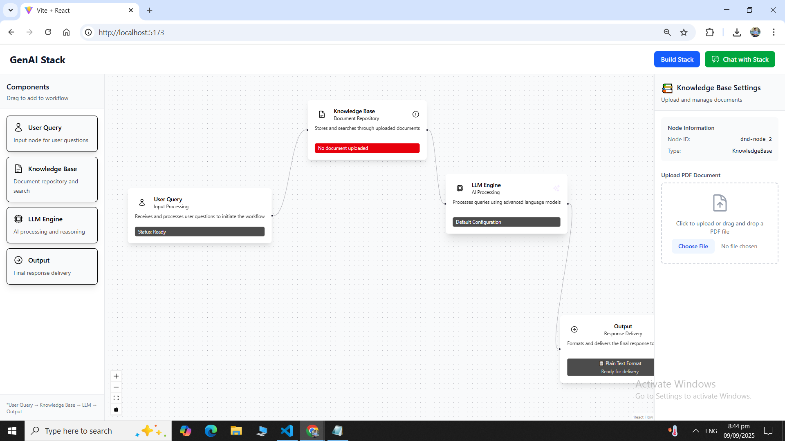

# No-Code AI Workflow Builder 🚀

This project is a full-stack web application that allows users to visually design, build, and interact with intelligent workflows. Users can connect components to handle queries, retrieve knowledge from documents, and generate responses from Large Language Models (LLMs).


---

## ✨ Features

-   **Visual Workflow Canvas:** Drag-and-drop interface for building custom workflows.
-   **KnowledgeBase Integration:** Upload PDF documents for Retrieval-Augmented Generation (RAG).
-   **LLM Engine:** Connect to powerful LLMs like OpenAI's GPT and Google's Gemini.
-   **Interactive Chat:** Test and interact with your built workflows through a chat interface.

---

## 🛠️ Tech Stack

-   **Frontend:** React.js, Vite, React Flow, Tailwind CSS
-   **Backend:** FastAPI (Python)
-   **Databases:**
    -   **PostgreSQL:** For storing metadata (documents, workflows).
    -   **ChromaDB:** For storing vector embeddings.
-   **AI & Services:**
    -   **Embeddings:** OpenAI Embeddings
    -   **LLMs:** OpenAI GPT, Google Gemini
    -   **Document Parsing:** PyMuPDF

---

##  Backend routes
```bash
curl -X POST "http://localhost:8000/api/v1/upload" \
  -H "accept: application/json" \
  -H "Content-Type: multipart/form-data" \
  -F "file=@document.pdf"
```

### Query Document (using curl):
```bash
curl -X POST "http://localhost:8000/api/v1/query" \
  -H "accept: application/json" \
  -H "Content-Type: application/json" \
  -d '{"query": "What is the main topic of the document?"}'

```


## 🏁 Getting Started

### Prerequisites

-   Node.js (v18 or higher)
-   Python (v3.10 or higher)
-   Postgres Database Url
-   An OpenAI API Key

### Installation & Setup

1.  **Clone the repository:**
    ```bash
    git clone [https://github.com/your-username/your-repo-name.git](https://github.com/your-username/your-repo-name.git)
    cd your-repo-name
    ```

2.  **Setup Backend:**
    -   Navigate to the `backend` folder: `cd backend`
    -   Create a virtual environment: `python -m venv venv` and activate it.
    -   Install dependencies: `pip install -r requirements.txt`
    -   Copy the example environment file: `cp .env.example .env`
    -   Update `.env` with your **OpenAI API Key** and postgres database credentials.

3.  **Setup Frontend:**
    -   Navigate to the `frontend` folder: `cd ../frontend`
    -   Install dependencies: `npm install`

    -   From the root directory, start the PostgreSQL and ChromaDB containers:
    ```bash
    docker-compose up -d
    ```

4.  **Run the Application:**
    -   **Terminal 1 (Backend):**
        ```bash
        cd backend
        # Make sure your virtual environment is active
        python main.py
        ```
    -   **Terminal 2 (Frontend):**
        ```bash
        cd frontend
        npm run dev
        ```

Your application should now be running, with the frontend available at `http://localhost:5173` and the backend at `http://localhost:8000`.

More detailed Code Documentation: `https://docs.google.com/document/d/10TlLCBmtMV5ClIkvPf6kxelhiUSHNIKBQ7PbgQ6zEik/edit?usp=sharing`


